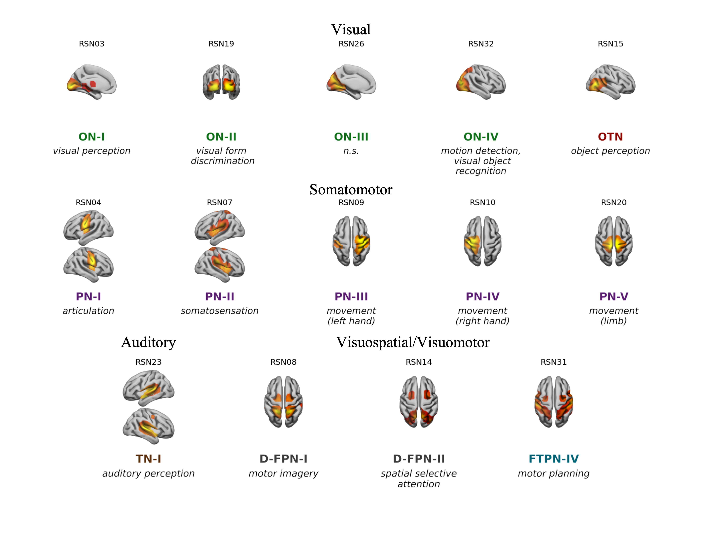
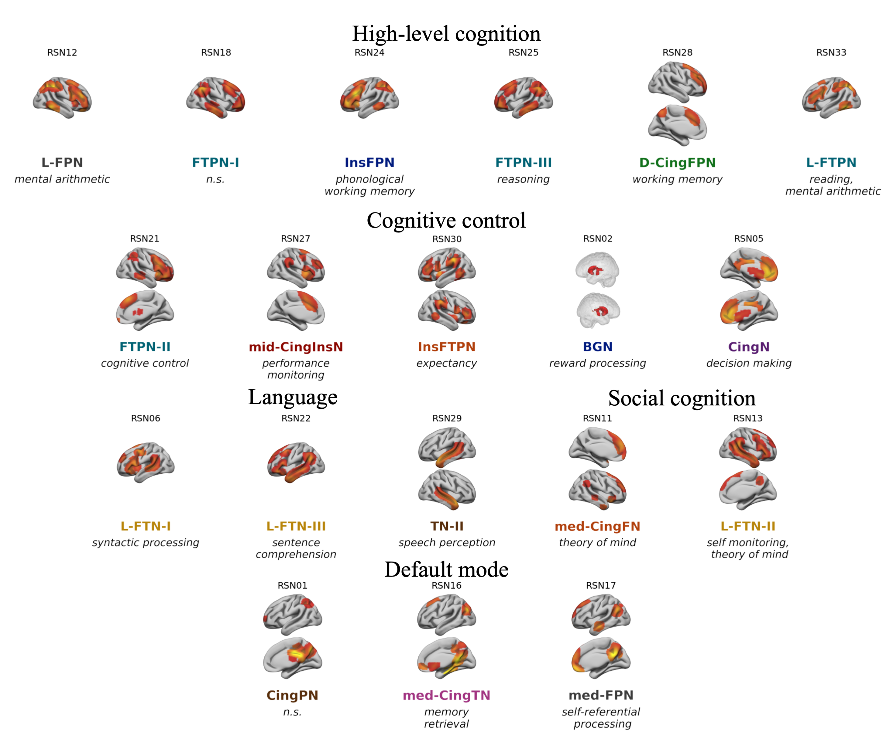

# GINNA: An atlas of 33 resting-state networks with empirical cognitive labelling


The Groupe d'Imagerie Neurofonctionnelle Network Atlas (GINNA) is a resting-state atlas that comprises 33 resting-state networks (RSNs). 

Each network has been evaluated with respect to its cognitive profile using a meta-analytic decoding strategy that rests on Neurosynth.
Each network is provided with a suggested cognitive label, as determined to faithfully summarize the results of the decoding by 6 independent neuroimaging experts. 

More details are available in the [preprint](https://doi.org/10.21203/rs.3.rs-4803512/v1)

Two versions of the atlas are provided: zstats maps (includes overlap) and binary maps (no overlap between networks). 

As the networks may overlap, the zstat atlas can be used as a probabilistic atlas. see [examples from nilearn](https://nilearn.github.io/dev/auto_examples/03_connectivity/plot_probabilistic_atlas_extraction.html).

# community-driven cognitive labeling

Summarizing a set of Neurosynth terms (e.g.: acoustic, comprehension, language) that were found significantly associated with each GINNA RSN is unarguably subjective and prone to errors.
We would greatly value feedbacks from the community regardings the attributed labels! Feel free to comment on any label or propose new ones using the GitHub Issues system. see [here](/community_labeling).

# Reproducibility 

Code to perform meta-analytic decoding is provided as a Jupyter notebook to allow full reproducibility.

All packages required to run the code (except NiMare) are included in the in-house rsfMRI data analysis package neuroginius, that can be installed using pip:

```
python -m pip install neuroginius
```
# The GINNA Atlas






# Summary of attributed cognitive processes for each RSN

| RSN   | Anatomical label   | Cognitive label (Cognitive Atlas ontology)   |
|:------|:-------------------|:---------------------------------------------|
| RSN01 | pCing-medPN        | n.s.                                         |
| RSN02 | R-FTPN-03          | n.s.                                         |
| RSN03 | ON-04              | motion detection, visual object recognition  |
| RSN04 | PcN-02             | articulation                                 |
| RSN05 | med-TN             | memory retrieval                             |
| RSN06 | PcN-01             | movement (limb)                              |
| RSN07 | med-FPN            | self-referential processing                  |
| RSN08 | D-FPN-03           | spatial selective attention                  |
| RSN09 | ON-01              | visual perception                            |
| RSN10 | D-FPN-01           | motor planning                               |
| RSN11 | PcN-03             | somatosensation                              |
| RSN12 | L-FTPN-02          | reasoning                                    |
| RSN13 | aCingN             | decision making                              |
| RSN14 | TN-01              | auditory perception                          |
| RSN15 | L-FTN              | syntactic processing                         |
| RSN16 | mCingFPN           | working memory                               |
| RSN17 | R-FTPN-01          | self monitoring, theory of mind              |
| RSN18 | FTPN-01            | expectancy                                   |
| RSN19 | L-FTPN-01          | sentence comprehension                       |
| RSN20 | R-FTPN-02          | mental arithmetic                            |
| RSN21 | L-PcN              | movement (right hand)                        |
| RSN22 | mCingInsN          | performance monitoring                       |
| RSN23 | L-InsFPN           | phonological working memory                  |
| RSN24 | BGN                | reward anticipation                          |
| RSN25 | R-PcN              | movement (left hand)                         |
| RSN26 | ON-03              | n.s.                                         |
| RSN27 | FTPN-02            | reading, mental arithmetic                   |
| RSN28 | med-FN             | theory of mind                               |
| RSN29 | ON-02              | visual form discrimination                   |
| RSN30 | D-FPN-02           | motor imagery                                |
| RSN31 | R-FInsN            | interference resolution                      |
| RSN32 | OTN                | object perception                            |
| RSN33 | TN-02              | speech perception                            |


