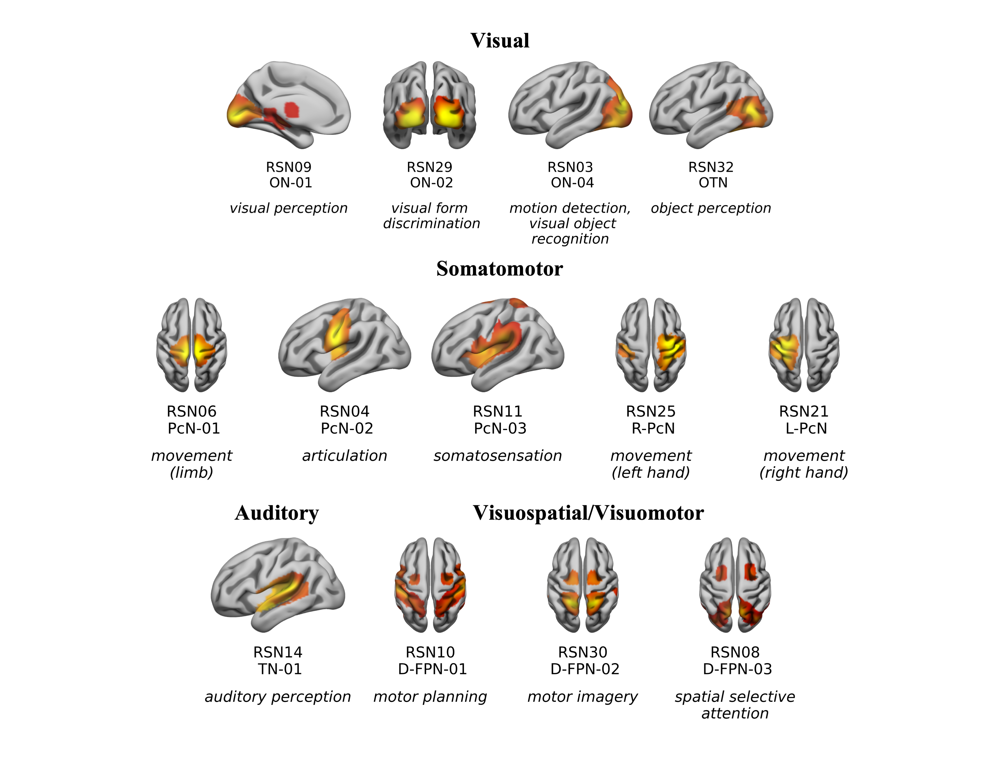
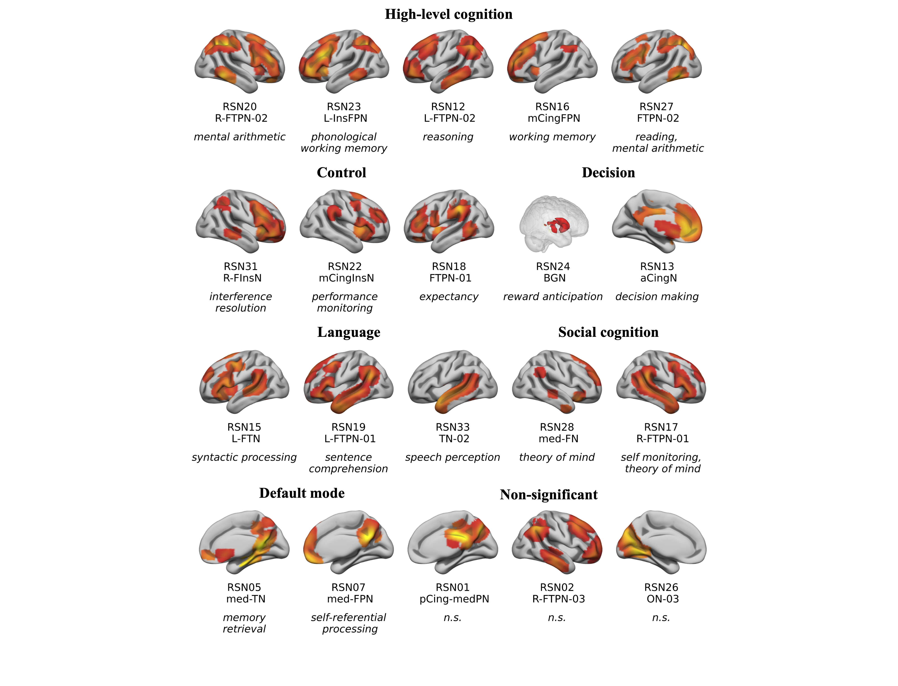

# ginna
GINNA: An atlas of 33 resting-state networks with empirical cognitive labelling

The Groupe d'Imagerie Neurofonctionnelle Network Atlas (GINNA) is a resting-state atlas that comprises 33 resting-state networks (RSNs). 

Each network has been evaluated with respect to its cognitive profile using a meta-analytic decoding strategy that rests on Neurosynth.
Each network is provided with a suggested cognitive label, as determined to faithfully summarize the results of the decoding by 6 independent neuroimaging experts. 

More details are available in the preprint:

paper doi xx

Two versions of the atlas are provided: zstats maps and binary maps. 

As the networks may overlap, the zstat atlas can be used as a probabilistic atlas. see [link] examples.

| RSN   | Anatomical label   | Cognitive label (Cognitive Atlas ontology)   |
|:------|:-------------------|:---------------------------------------------|
| RSN01 | CingPN             | n.s.                                         |
| RSN02 | BGN                | reward processing                            |
| RSN03 | ON-I               | visual perception                            |
| RSN04 | PN-I               | articulation                                 |
| RSN05 | CingN              | decision making                              |
| RSN06 | L-FTN-I            | syntactic processing                         |
| RSN07 | PN-II              | somatosensation                              |
| RSN08 | D-FPN-I            | motor imagery                                |
| RSN09 | PN-III             | movement (left hand)                         |
| RSN10 | PN-IV              | movement (right hand)                        |
| RSN11 | med-CingFN         | theory of mind                               |
| RSN12 | L-FPN              | mental arithmetic                            |
| RSN13 | L-FTN-II           | self monitoring, theory of mind              |
| RSN14 | D-FPN-II           | spatial selective attention                  |
| RSN15 | OTN                | object perception                            |
| RSN16 | med-CingTN         | memory retrieval                             |
| RSN17 | med-FPN            | self-referential processing                  |
| RSN18 | FTPN-I             | n.s.                                         |
| RSN19 | ON-II              | visual form discrimination                   |
| RSN20 | PN-V               | movement (limb)                              |
| RSN21 | FTPN-II            | cognitive control                            |
| RSN22 | L-FTN-III          | sentence comprehension                       |
| RSN23 | TN-I               | auditory perception                          |
| RSN24 | InsFPN             | phonological working memory                  |
| RSN25 | FTPN-III           | reasoning                                    |
| RSN26 | ON-III             | n.s.                                         |
| RSN27 | mid-CingInsN       | performance monitoring                       |
| RSN28 | D-CingFPN          | working memory                               |
| RSN29 | TN-II              | speech perception                            |
| RSN30 | InsFTPN            | expectancy                                   |
| RSN31 | FTPN-IV            | motor planning                               |
| RSN32 | ON-IV              | motion detection, visual object recognition  |
| RSN33 | L-FTPN             | reading, mental arithmetic                   |

